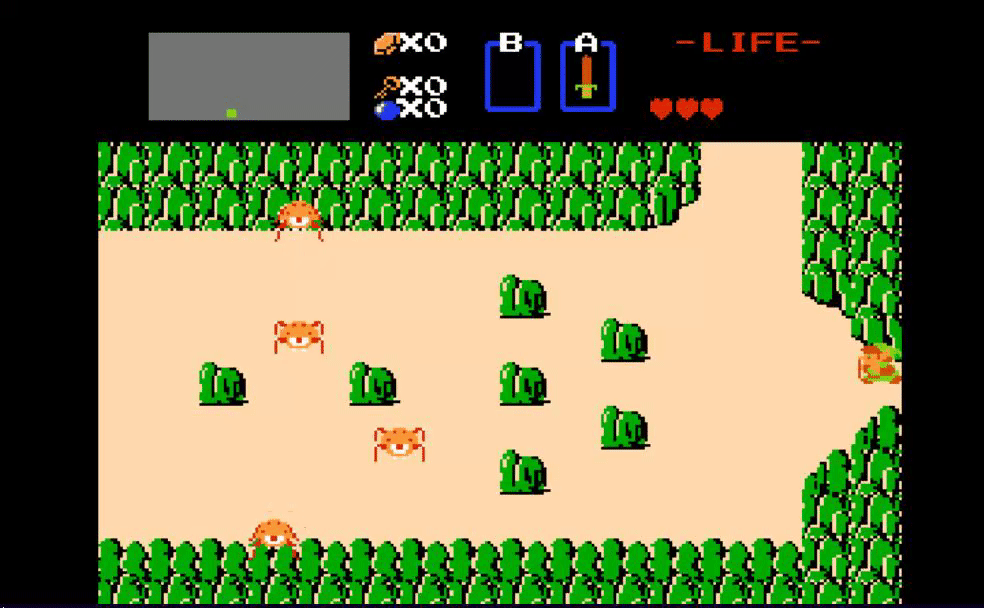
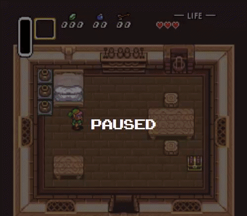
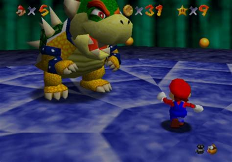
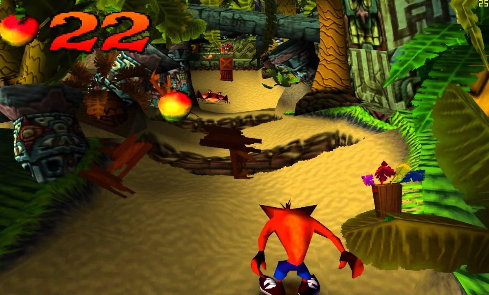
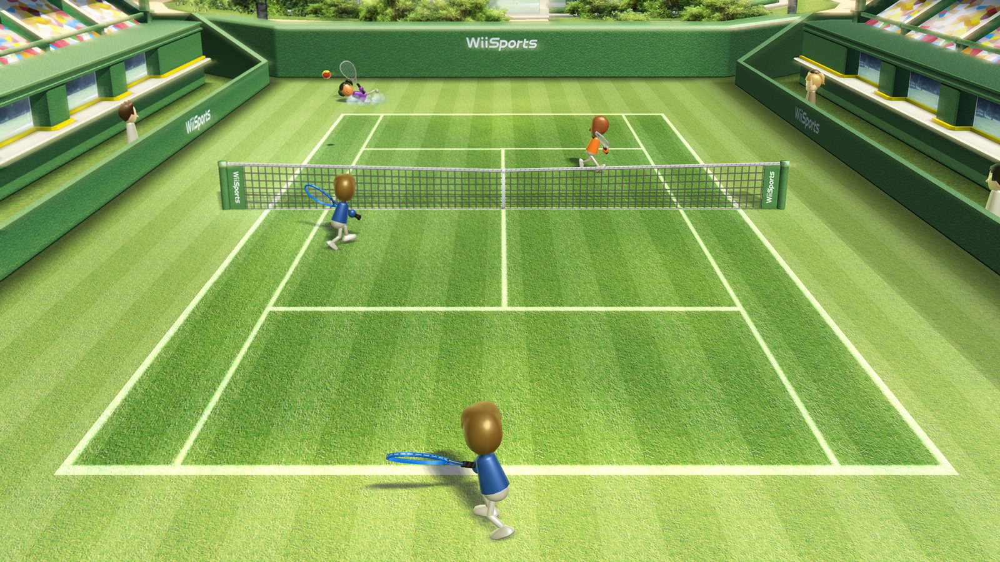
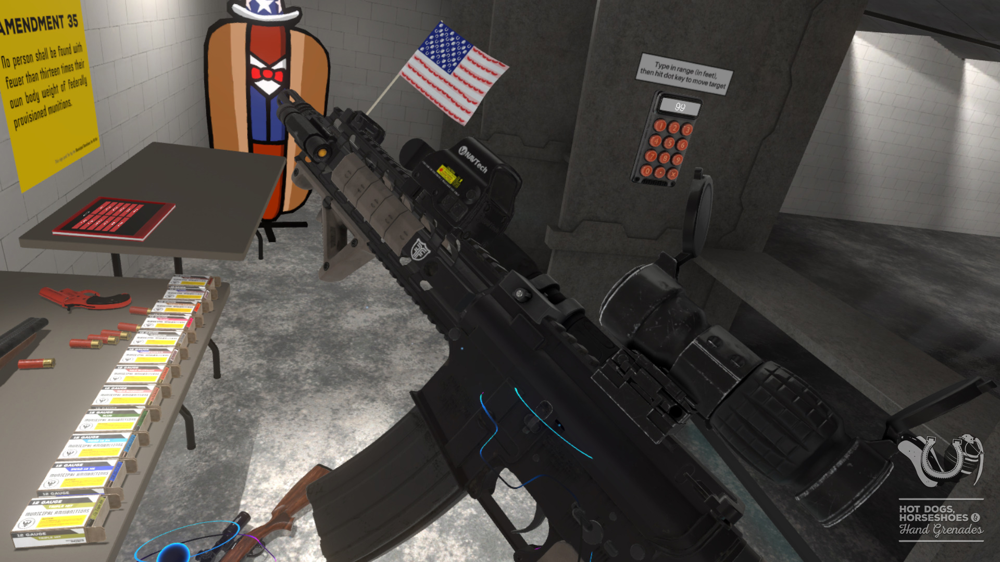
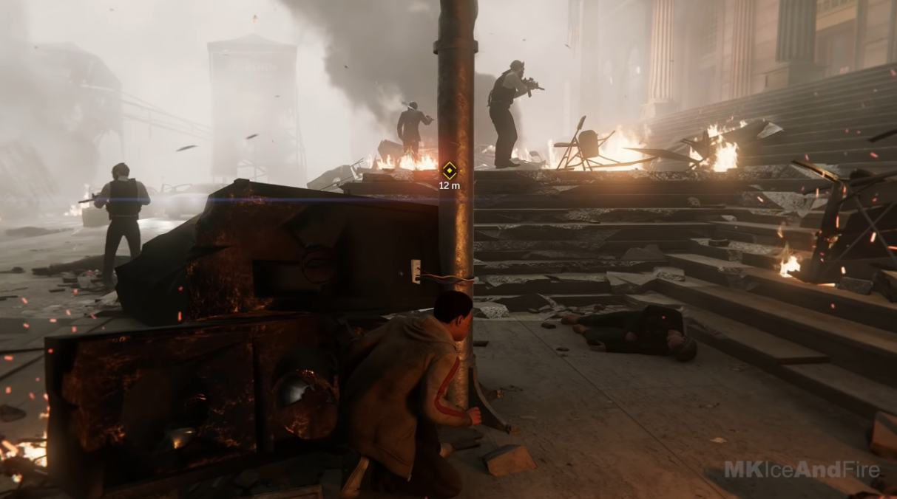

# L'histoire des graphiques dans les jeux vidéos

  Avec chaque génération de consoles, les capacités de ceux-ci avance à mesure que la technologie évolue.
  En seulement quelque dizaine d'années, nous sommes passés de jeux basés sur du texte à des visuels photoréalistes.
  

  
>Interface de Will Crowther's Adventure (1976)

> Grand Theft Auto 5 (2013)

[Lien Steam](https://store.steampowered.com/app/271590/Grand_Theft_Auto_V/)

## Graphiques basés sur du texte

Plus commun entre 1970 et 1990 puisqu'ils étaient plus facile à créer et utilisent moins de ressources pour les faire fonctionner.
La grande majorité de ces jeux étaients des RPG, soit en solo ou multijoueur.

 >SanctuaryRPG (2015)
 
 [Lien Steam](https://store.steampowered.com/app/328760/SanctuaryRPG_Black_Edition/)

## Graphiques basés sur des vecteurs

Cette forme de visuels utilisents des points, des lignes et de courbes (en gros équations mathématiques) pour illustrer des éléments.
Ceci n'a pas duré très longtemps par contre puisqu'ils ne pouvaient pas rivaliser avec les jeux qui utilisaient des sprites 2D.

>Asteroids (1979)

## Sprites

Utilisé dans le passé et même encore aujourd'hui. Le terme Graphiques 2D est très général et inclus plusieurs sortes de manières de représenter des illustrations. La majorité de ceux-ci utilisent des sprites.
Par exemple:

### Top down perspective

Comme le nom le dit, la caméra est dans le ciel et on voit tout d'en haut.

> Hotline Miami 2: Wrong Number (2015)

[Lien Steam](https://store.steampowered.com/app/274170/Hotline_Miami_2_Wrong_Number/)

### Side-scroller

Jeu où la caméra est sur le côté. Généralement, les personnages peuvent seulement bouger vers la droite, la gauche, le haut et le bas.

> Gensokyo Night Festival (2019)

[Lien Steam](https://store.steampowered.com/app/1122050/Gensokyo_Night_Festival/)

### 2.5D

Technique qui utilise des moyens tel que des vues isométriques pour imiter tridimensionalité.

> The Sims (2000)
> La majorité des éléments, comme les personnages, sont des images 2D.

# Les sprites dans les jeux

La grande majorité des jeux 2D utilisent des sprites pour les visuels. Aujourd'hui, il n'y a pas de limites au détails qu'on peut inclure dans ceux-ci mais dans le temps les consoles n'avait pas autant de puissance de calcul.

## La première génération

Réfère aux consoles des années 1972 à 1983. Puisque c'était à ce temps ci que les premières consoles pour la maison ont été inventés, les capacités de ceux-ci étaient très limitées. Par exemple, Pong par Atari, un jeu d'arcade basé sur le ping pong, consistait seulement de 2 chiffres, deux lignes, un point et une ligne pointillé.

> Pong (1972)

## La deuxième génération

Réfère aux consoles et ordinateurs des années 1976 à 1992. Le public ont vu le potentiel des jeux vidéos et des avancements ont rapidement été créées pour les améliorer. En général, les jeux avaient de la couleur mais les limites de la console fait que ceux-ci pouvait seulement afficher quelque couleurs en même temps.

Le fantôme scintillait partout pour représenter tout les fantômes qui apparaissaient.

> Pac-Man (Atari 2600) (1982)

## La troisième génération

Réfère aux consoles et ordinateurs des années 1983 à 1987. Aussi connu en tant que l'ère du 8 bit, c'est ici que Nintendo à commencer à se faire un nom, avec la sortie de la Famicom (ou la Nintendo Entertainment System ici). Autre que plus de mémoire dans les consoles, donc plus de sprites, couleurs et détails en général, une innovation majeure de cette génération inclus la capabilité de sauvegarder ton progrès dans des jeux.

Plus de couleurs et resolution! Meilleur musique!

> The Legend of Zelda (1986)

## La quatrième génération

Réfère aux consoles et ordinateurs des années 1987 à 1996. Aussi connu en tant que l'ère du 16 bit, il n'y a pas vraiment d'innovation dans cette génération, autre que plus de mémoire. Cette génération est aussi la dernière qui favorisait les jeux en 2D.

> The Legend of Zelda: A Link to the Past (1986)

Les couleurs!!!

## 3D

Comme la section sur le 2D, le terme 3D peut désigner plusieurs moyens de représenter des graphiques mais l'élément en commun entre tout ceux-là c'est que on peut se déplacer dans les 6 directions.

### 3D Fixe

Semblable à des jeux sidescroller, la caméra est dans un emplacement fixe mais presque tout les éléments sur l'écran sont en 3D.

> Final Fantasy VII (1997)

Remarquez les polygones sur les personnages!

### Première Personne

Jeux qui utilise la perspective de la première personne. La grande majorité de ceux-ci ont des armes à feu.

> Counter-Strike: Global Offensive (2012)

### Troisième Personne
Jeux qui utilise la perspective de la troisième personne.

> Super Mario 64 (1996)

J'aurais mis un gif mais je n'ai pas de jeux à la 3e personne lol

### Voxel

Au lieu d'utiliser des triangles pour représenter des formes, le voxel utilise des cubes dans un espace 3D. Comme du pixel art mais en 3D!

> Minecraft (2011)

Il n'y a pas vraiment de variété dans le 3D.

# Les graphiques 3D

Utilisé dans la grande majorité des jeux contemporaire, ceux-ci consistent principalement de polygones pour créer des modèles 3D mais il y a certaine exceptions.

## La cinquième génération

Réfère aux consoles des années 1993 à 2006. Aussi connu en tant que l'ère du 3D. C'est à cette génération que les jeux ont fait un saut du 2D au 3D. Autre qu'une dimension en plus, la résolution à grandement monté , le nombre de couleurs qu'on peut choisir monte à environ 16 million et la qualité de son est monté à la qualité CD. Puisque la mémoire reste limité, beaucoup des modèles 3D avaient des polygones visible.

> Crash Bandicoot (1996)

## La sixième génération

Réfère aux consoles des années 1998 à 2005. Il n'y a pas vraiment d'innovations à noter autre que l'utilisation de l'internet pour faciliter le multijoueur et des jeux en HD.

> The Simpsons: Hit and Run (2003)

## La septième génération

Réfère aux consoles des années 2005 à 2012. Il n'y a pas vraiment d'innovations à noter autre que de la meilleur performance en générale.

> Wii Sports (2006)

## Huitième génération

Réfère aux consoles des années 2012 à 2019. C'est ici qu'il y a des avancements en Realité Virtuelle et en Cloud Gaming. Performance générales améliorées.

> Hotdogs, Horseshoes and Handgrenades (2016)

[Lien Steam](https://store.steampowered.com/app/450540/Hot_Dogs_Horseshoes__Hand_Grenades/)

J'aurais fait un gif mais ça me tentait pas de mettre mon casque

## Neuvième génération

Réfère aux consoles des années 2020 et à une date indéfinie dans le futur. Bla bla meilleur performance.

> Marvel's Spider-Man Remastered (2020)

# Conclusion

En conclusion, les graphiques se sont amélioré très rapidement. En une quarantaine d'années, on est passé à des lettres à des jeux qui sont plus beaux que la vraie vie.
